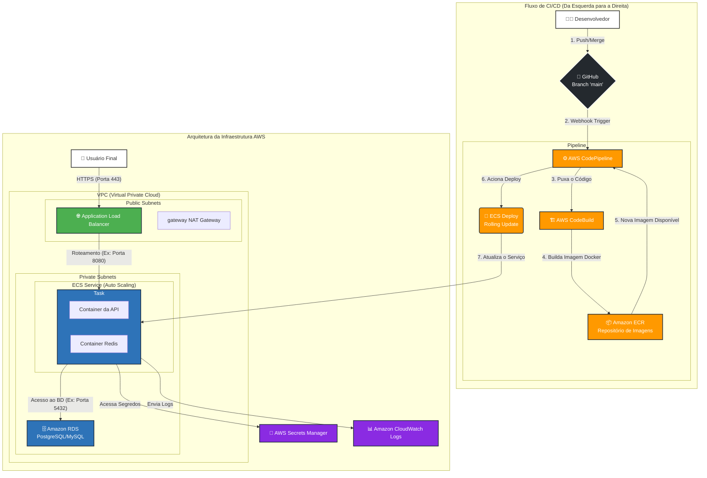

# Plano de Ação: API com ECS, ALB, RDS e CI/CD

## Diagrama da Arquitetura

```mermaid
graph TD
    subgraph "Fluxo de CI/CD (Da Esquerda para a Direita)"
        direction LR
        Dev[👨‍💻 Desenvolvedor] -- 1. Push/Merge --> GH{🐙 GitHub <br> Branch 'main'}
        GH -- 2. Webhook Trigger --> CP[⚙️ AWS CodePipeline]

        subgraph "Pipeline"
            direction LR
            CP -- 3. Puxa o Código --> CB[🏗️ AWS CodeBuild]
            CB -- 4. Builda Imagem Docker --> ECR[📦 Amazon ECR <br> Repositório de Imagens]
            ECR -- 5. Nova Imagem Disponível --> CP
            CP -- 6. Aciona Deploy --> ECS_Deploy(🚀 ECS Deploy <br> Rolling Update)
        end
    end

    subgraph "Arquitetura da Infraestrutura AWS"
        User[👤 Usuário Final] -- HTTPS (Porta 443) --> ALB

        subgraph "VPC (Virtual Private Cloud)"
            subgraph "Public Subnets"
                ALB[🌐 Application Load Balancer]
                NAT[ gateway NAT Gateway]
            end

            subgraph "Private Subnets"
                subgraph "ECS Service (Auto Scaling)"
                    Task[📝 ECS Task <br> Fargate]
                    subgraph Task
                        direction LR
                        API[Container da API]
                        Redis[Container Redis]
                    end
                end
                RDS[🗄️ Amazon RDS <br> PostgreSQL/MySQL]
            end
        end

        ALB -- Roteamento (Ex: Porta 8080) --> Task
        Task -- Acesso ao BD (Ex: Porta 5432) --> RDS
        Task -- Acessa Segredos --> SecretsManager[🔑 AWS Secrets Manager]
        Task -- Envia Logs --> CW[📊 Amazon CloudWatch Logs]
        ECS_Deploy -- 7. Atualiza o Serviço --> Task

    end

    style Dev fill:#fff,stroke:#333,stroke-width:2px
    style User fill:#fff,stroke:#333,stroke-width:2px
    style GH fill:#24292e,stroke:#fff,stroke-width:2px,color:#fff
    style CP fill:#FF9900,stroke:#232F3E,stroke-width:2px,color:#fff
    style CB fill:#FF9900,stroke:#232F3E,stroke-width:2px,color:#fff
    style ECR fill:#FF9900,stroke:#232F3E,stroke-width:2px,color:#fff
    style ECS_Deploy fill:#FF9900,stroke:#232F3E,stroke-width:2px,color:#fff
    style ALB fill:#4CAF50,stroke:#232F3E,stroke-width:2px,color:#fff
    style Task fill:#2E73B8,stroke:#232F3E,stroke-width:2px,color:#fff
    style RDS fill:#2E73B8,stroke:#232F3E,stroke-width:2px,color:#fff
    style SecretsManager fill:#8A2BE2,stroke:#232F3E,stroke-width:2px,color:#fff
    style CW fill:#8A2BE2,stroke:#232F3E,stroke-width:2px,color:#fff
```
